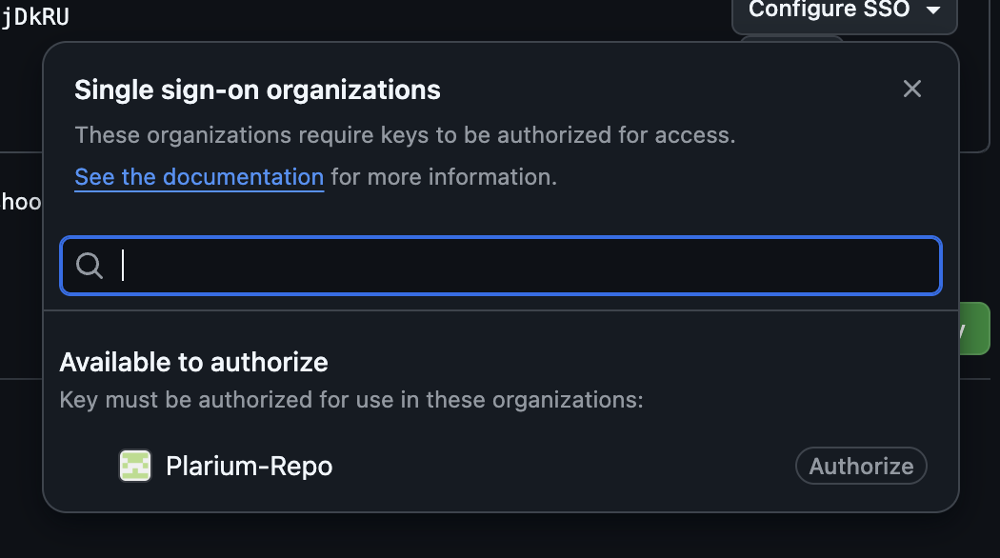

# Plarium's DS Project Template

This template is the agreed upon structure for DS projects for Plarium's DS.<br>
It allows for:
- Developing sources offline in an IDE of one's choice.
- Working with DataBricks for extra fire-power 🔫.
- Managing virtual environments and dependencies like pros.
- Maintain documentation within the project.

The template is using [cookiecutter](https://cookiecutter.readthedocs.io/en/1.7.2/index.html).

## Template structure

```
{{cookiecutter.project_name}}
├── data
├── notebooks
│   └── example.ipynb
├── reports
├── src
│   └── {{cookiecutter.project_slug}}
│       ├── __init__.py
│       └── util.py
├── tests
│   ├── __init__.py
│   └── test_util.py
├── __util__.py
├── pyproject.toml
├── pytest.ini
├── Makefile
├── README.md
├── .gitignore
└── .pre-commit-config.yaml
```

### `Makefile`

Standard way to automate actions in a direcory, for more information about make, visit [here](https://makefiletutorial.com/).<br>
Running `make help` will detail the default actions:
```
{{cookiecutter.project_name}} repo common tasks:
  make setup        - Create git, venv and install dev dependencies
  make venv         - Create a virtual environment
  make install-dev  - Install in editable mode with [dev] extras
  make pre-commit   - Install and configure pre-commit hooks
  make clean        - Uninstall the build, clean artifacts and delete the venv directory
  make build        - Build the package for distribution.
```

### `notebooks/_ini_.ipynb`

Part of the setup to work both locally and remotely with DataBricks.<br>
Every notebook's first cell must include:

```python
%run "./_init_.py"
``` 

This will point the sources path to the `src` directory allowing for importing directly from sources.

Locally, it will have no use. Proper installation using `make setup` will install the sources in ["editable"](https://setuptools.pypa.io/en/latest/userguide/development_mode.html) mode.

### pytest

We are using [pytest](https://docs.pytest.org/en/stable/) for unittest discovery. The template include a simple unittest to check if everything works.

### `.pre-commit-config.yaml`

Contains [pre-commit](https://pre-commit.com/) hooks.<br>
The hooks we have ensure:<br>
1. [`nbstripout`](https://github.com/kynan/nbstripout) to clean notebooks before they are pushed to a git repo. To keep results, make sure you create a report.
2. Running tests before we push to git.

## Using the template

1. We recommend to install python 3.11 as it is the native distribution on DataBricks:

   ```
   brew install python@3.11
   ```
   If you don't have `brew` installed visit [here](https://brew.sh/).

   
1. [Install cookiecutter](https://cookiecutter.readthedocs.io/en/1.7.2/installation.html). it should NOT be installed in a specific virtual environment, rather it should be installed in the global python you have on your machine.

    ```bash
    python3.11 -m pip install cookiecutter
    ```

2. Go to the directory where your project root will be created and run:

    ```bash
    cookiecutter https://github.com/ak-plarium/ds-project-template
    ```

    You will be prompted to fill the details of the project - **Note:** to use an underscore (`_`) instead of a hyphen (`-`) in `project_slug`.
    

4. Next, `cd` into your new project directoy and run `make setup`. <br>
    ```bash
    cd [project_directory]
    make setup
    ```

    This will:<br>
    1. Initiate a git repo (Only if you have not already)
    2. Create a venv
    3. Install requirements from `pyporoject.toml` and the package itself as an editable copy.
    4. Install pre-commit and setup the local hooks.

5. To test everything has installed properly, activate the venv and run tests.

    ```bash
    source .venv/bin/activate
    pytest
    ```

    You should see:
    ```bash
    .                           [100%]
    1 passed in 0.01s
    ```

## Syncing your project with DataBricks

The sync is done with git, to perform the sync, you will need to have a git account.

### Git SSH <> DataBricks setup

1. If you have not done so, set a ssh key for github, following the instructions [here](https://docs.github.com/en/authentication/connecting-to-github-with-ssh/generating-a-new-ssh-key-and-adding-it-to-the-ssh-agent).

2. Plarium uses SSO for the keys so you will have to authorize it for Plarium-repo. 
   - Go to [github.com](https://github.com/)
   - Under your profile image in the top right, click **Settings** > **SSH and GPG keys**. if your key is configured you should see this: 


   - Click the `Confgire SSO` drop down menu, and click authorize here:


2. Create a new repo on DataBricks with the **same name as your project name**, push the local repo to the remote.

3. Create a **Personal Access Token** for DataBricks so that it can read your repos. 
   - Go to: **Settings** > **Developer Settings** > **Personal access tokens**
   - Choose **Tokens (classic)**. Click **Generate new token** > **Generate new token (classic)**. 
   - Under the **Note** write `databricks` 
   - Under **Expiration** choose `No Expiration`
   - Under **Select Scopes** mark all of the `repo` scope. This is how your screen should look like this: 
   - Scroll down and click **Generate token**
   - Copy the token from here:
   - Click the **Configue SSO** and authorize (like you did with the SSH token).
   - Go to databricks, under your profile choose **Settings** > **Linked accounts**
   - Under **Git integration**, set **Git provider** to `GitHub`
   - Choose **Personal access token**
   - Under **Git provider username or email** enter your git username
   - Paste the token from github under . Your screen should look like this: 
   - Click **Save**. Yay! 🥳

### Sync a toy project

1. Create some project using the cookiecutter template.

2. Run `make setup` from the project folder.

3. Create a repo on github with the same project name.

4. Setup the remote and push.
   ```bash
   git remote add origin git@github.com:Plarium-Repo/your-repo-name.git
   git push -u origin main

6. Go to databricks, under **Workspace** > **Repos** > **Your username** you should see a screen like this (with no repos):

7. Click **Create** > **Repo**, you should see a screen like this:
8. Fill up the information:
   - Under **Git repository URL** paste the url of your repo.
   - Under **Git provider** choose `GitHub`
   - Under **Repository name** we recommend to write the name of the repo as it appears on GitHub. This is equivalent to `git clone`, if you supply another name the repo will be cloned under that name.
   - Click **Create Repo**, your toy project should now be available.

### Test it

1. Go to the repo, choose **notebooks** > **example**
2. Start a machine or choose one that is running. This can take some time... ☕️.
3. Run the 2 cells, it should print "Hello World!". You should see something like this:


## Creating a job on DataBricks that points to your repo and branch

Once your repo is synced, and you have a notebook you want to put in a workflow:

1. On DataBricks go to **Workflows** > **Create** > **Job**
2. Fill up:
   1. Task name
   2. Type: Choose Notebook
   3. Source: Choose Git Provider
      1. Click **Edit**, a pop up form will appear
      2. Paste the github-url
      3. Choose the right git reference for your project (recommended: main branch)
      4. Click **Confirm**
      
      
   4. Path: write the path from the root of the directory: i.e. `notebooks/example` without file extensions
   4. Compute: Choose the right machine for the job (TBD more on this later). Your form should look like this:
   
   5. Click **create task**
   6. On the right hand panel under Schedules and triggers you can schedule or set a trigger. Or.. just click **Run now** and see if the job runs.
   If all works well you should see:
   


